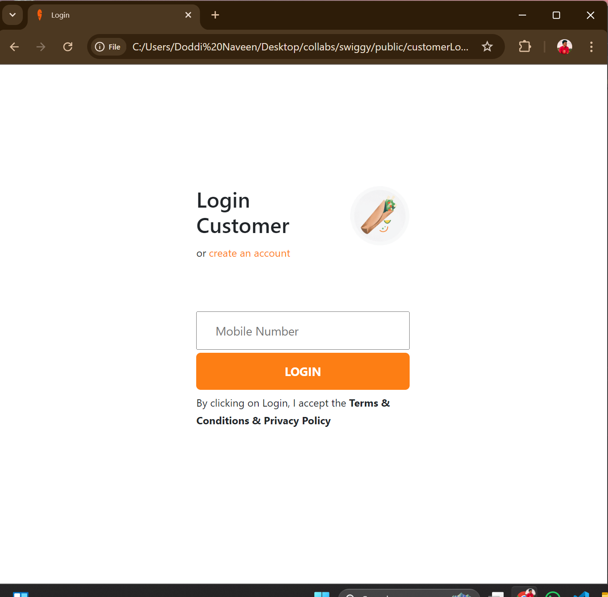
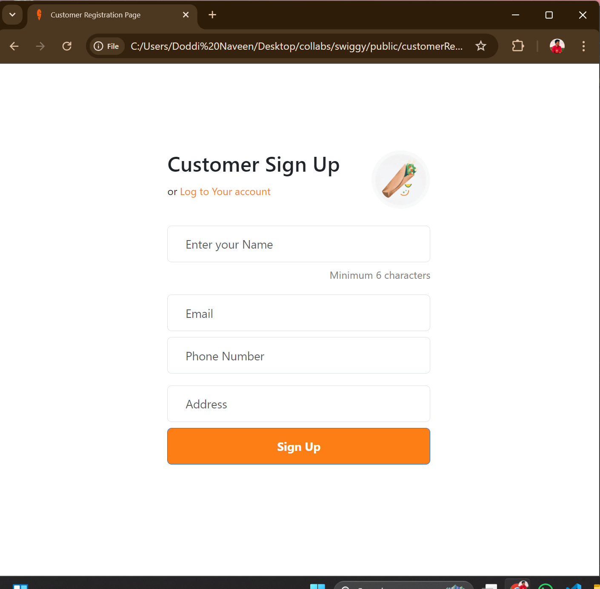
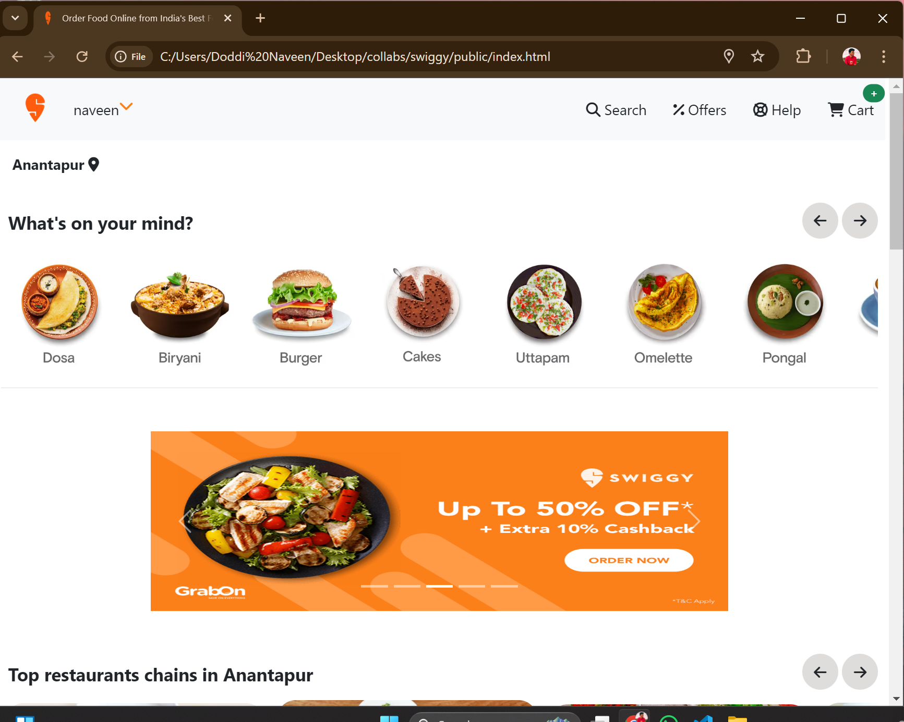
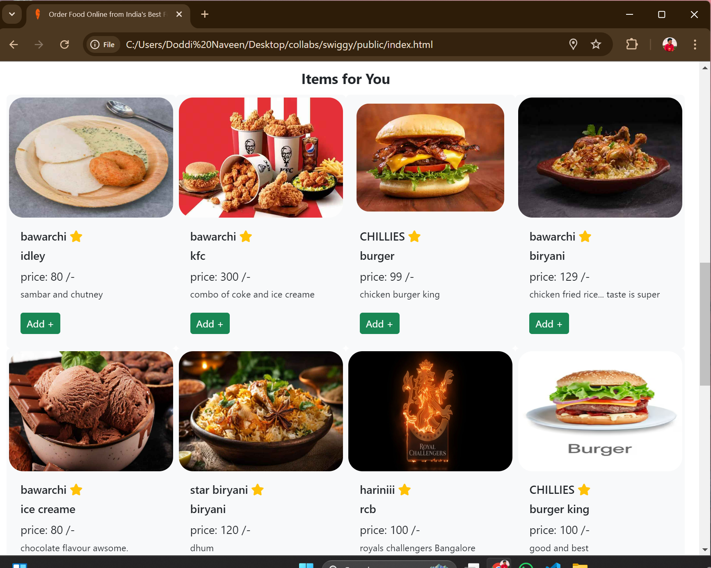
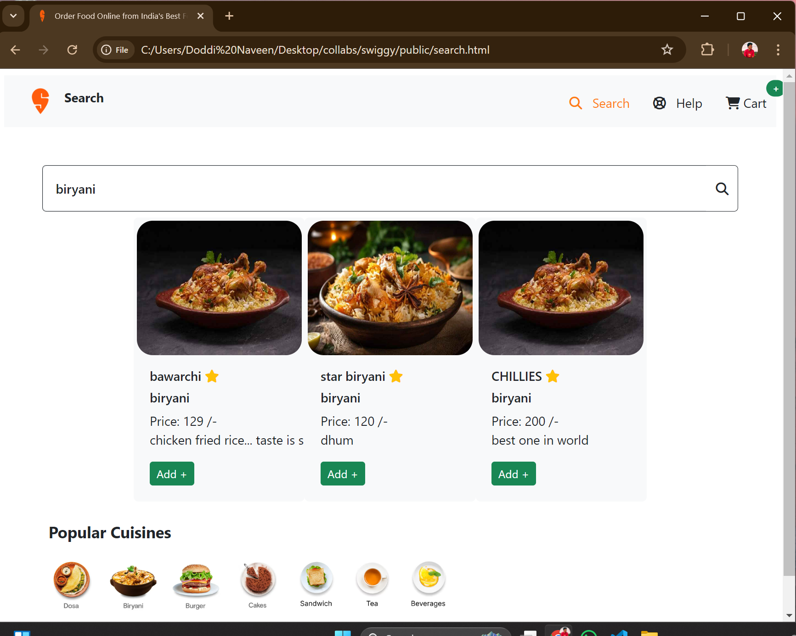
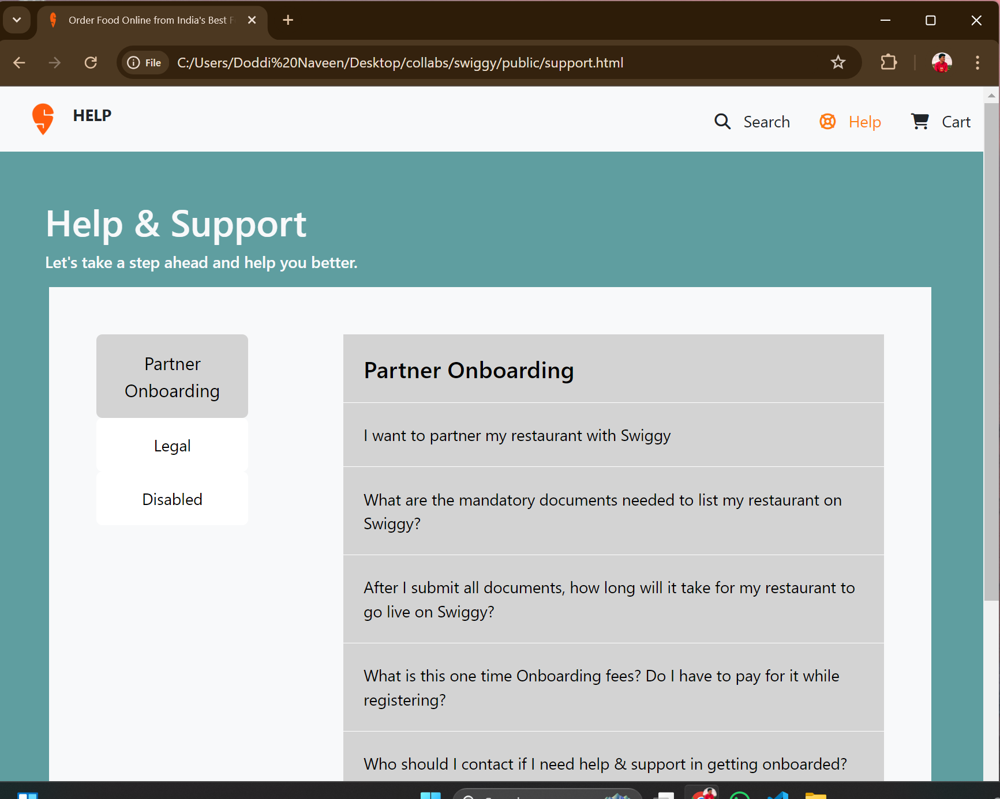
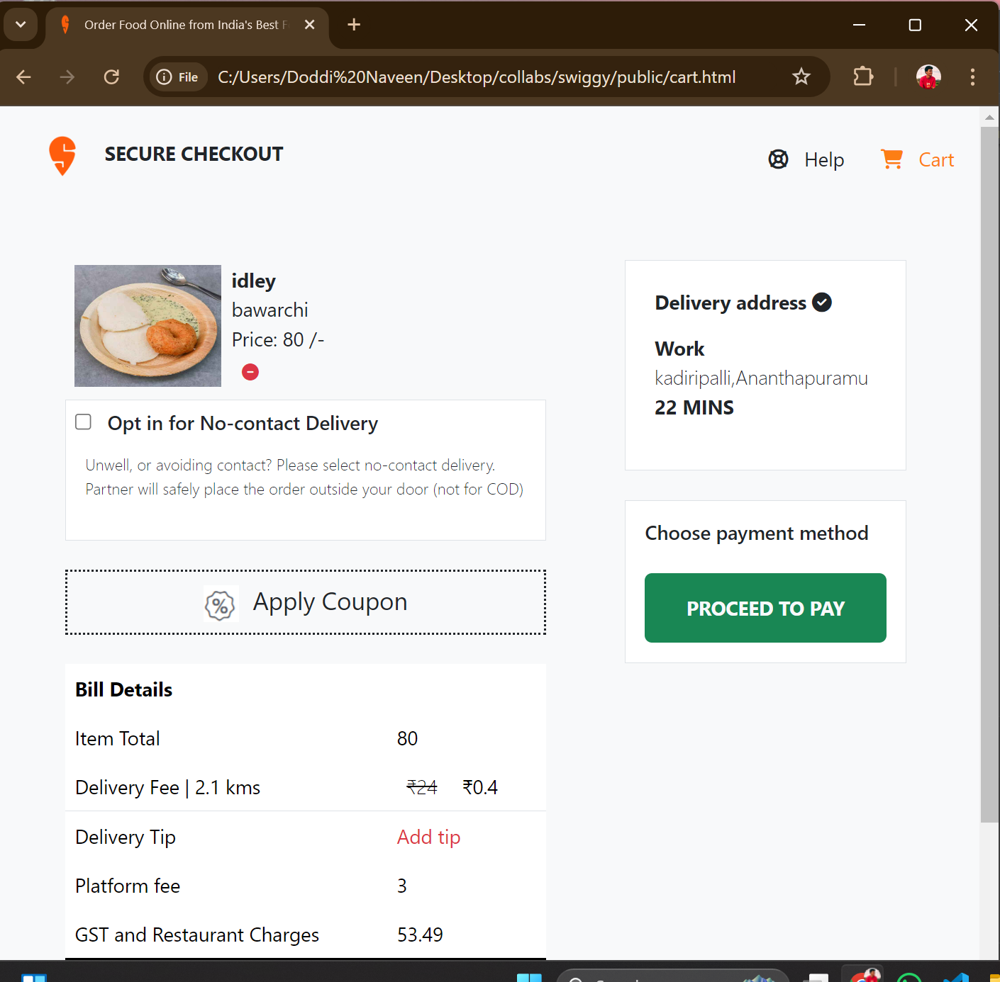
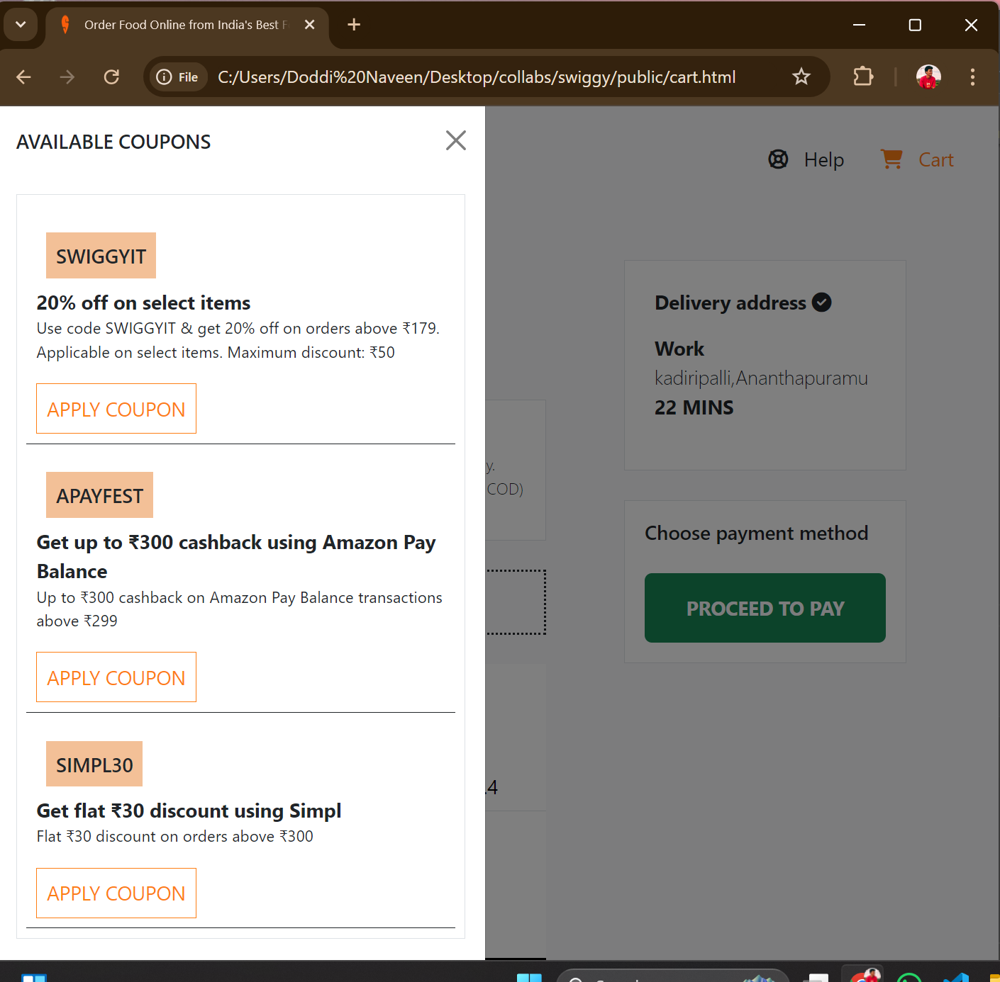
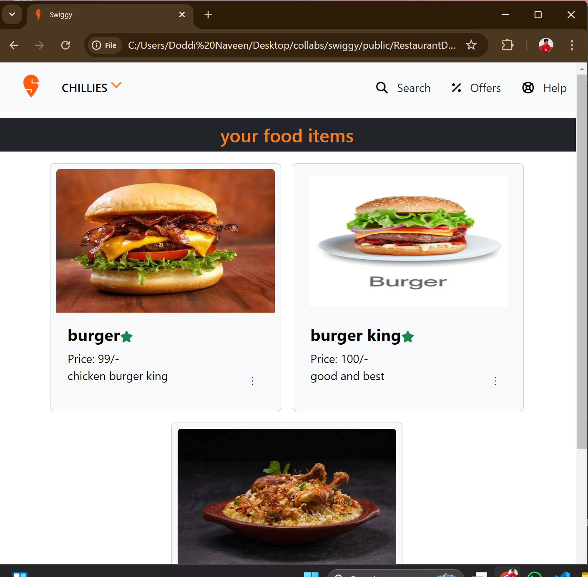
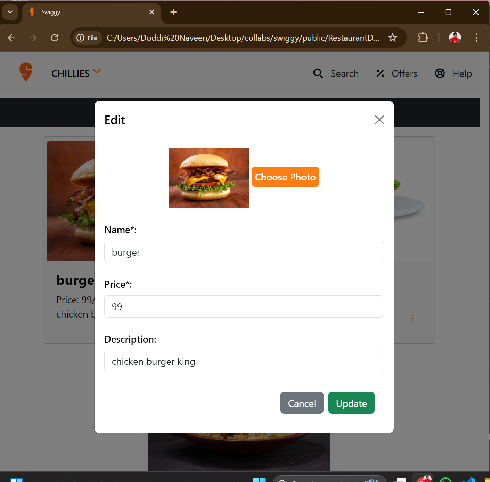

# SWIGGY

## Description

Order Food Online from India's Best Food Delivery Service | Swiggy  

* This project consists of both __Customer__ and __Restraurant__ pages
* Both pages have their registration and login pages



* Customer page    
    * home -> displays food items uploaded by the restraurants, you can also add items to your cart.  
    
    
    * search -> get the food items based on the customer input.    
    
    * support -> consists all basic questions.
    
    
    * cart -> displays food items from the cart, apply coupons and complete the order.  
        
            


* Restraurant page  
    * home => new food items can be add, and edit and remove items   
        * add  
        * edit  
        * remove  

    
    


## Getting Started


### Dependencies

* cors: ^2.8.5,
* json-server: ^1.0.0-alpha.23
* nodemon: ^3.1.0

### Installing

* You need to install json-server using command -> ``` npm i json-server ```

* if any problem in installation
    * [installation json-server](https://chrisdevcode.hashnode.dev/how-to-create-and-deploy-a-json-server)

### Executing program

* Run db.json file using the following commands
```
json-server --watch db.json 
         or 
json-server --watch db.json --port 3000

```

## Help

Any advise for common problems or issues.
```
command to run if program contains helper info
```

## Authors

Contributors names and contact info

Naveen Doddi
[@naveeendoddi](https://twitter.com/naveeendoddi)

## Version History

* 0.1
    * Initial Release

## License

This project is licensed under the [ swiggy_clone] License - see the LICENSE.md file for details

## Acknowledgments
